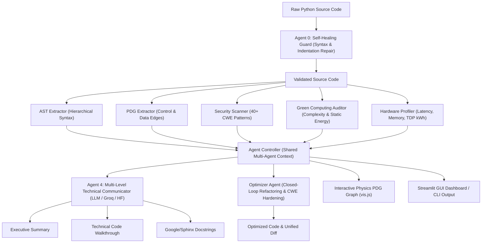

# Code Summarization Using AST and NLP

[](https://www.python.org/)
[](LICENSE)
[](https://streamlit.io/)
[](#multi-agent-system)

An intelligent code analysis, summarization, security auditing, and optimization pipeline that combines **Abstract Syntax Tree (AST)** structural parsing, **Program Dependence Graph (PDG)** control & data dependency extraction, and **Large Language Models (NLP)**.

Developed by **Sathwik M (25CSB1A22)** and **N Harsha (25CSB1A04)**.

---

## Table of Contents

- [Overview](#overview)
- [System Architecture](#system-architecture)
- [Key Features](#key-features)
  - [Multi-Agent Collaboration Engine](#multi-agent-collaboration-engine)
  - [AST & PDG Dependency Analysis](#ast--pdg-dependency-analysis)
  - [Green Computing & Hardware Profiling](#green-computing--hardware-profiling)
  - [Security Vulnerability Scanner](#security-vulnerability-scanner)
  - [Autonomous Self-Healing Guard](#autonomous-self-healing-guard)
  - [Closed-Loop Optimizer Agent](#closed-loop-optimizer-agent)
- [Interactive Interfaces](#interactive-interfaces)
  - [Streamlit Web Application](#streamlit-web-application)
  - [Command-Line Interface (CLI)](#command-line-interface-cli)
  - [Physics-Based Interactive PDG Graph](#physics-based-interactive-pdg-graph)
- [Project Directory Structure](#project-directory-structure)
- [Getting Started](#getting-started)
  - [Prerequisites](#prerequisites)
  - [Installation](#installation)
  - [Environment Configuration](#environment-configuration)
- [Usage Examples](#usage-examples)
- [Model Training](#model-training)
- [Documentation](#documentation)
- [License](#license)

---

## Overview

Traditional code summarization systems rely exclusively on raw text tokens, frequently missing semantic relationships, control branches, and data flows. 

**Code Summarization Using AST and NLP** solves this by:
1. Parsing code into an **Abstract Syntax Tree (AST)** to capture syntax hierarchy.
2. Constructing a **Program Dependence Graph (PDG)** to capture data definitions, consumers, and control flows.
3. Supplying structured graph semantics into high-performance **Open-Source LLMs** (e.g., Qwen 2.5 Coder, LLaMA 3.1 via Groq/Hugging Face) or fine-tuned **CodeT5** models.
4. Orchestrating a **5-Agent Autonomous Collaboration Engine** providing real-time vulnerability scanning, green compute footprint tracking, automated syntax repair, and code optimization.

---

## System Architecture



---

## Key Features

### Multi-Agent Collaboration Engine
`agent_controller.py` orchestrates five specialized agents:
- **Agent 0: Self-Healing Guard** (`self_healing.py`): Catches syntax errors, missing colons, indentation issues, and unbalanced brackets before parsing.
- **Agent 1: Structural Inspector** (`ast_extractor.py`, `pdg_extractor.py`): Extracts semantic control and data dependencies.
- **Agent 2: Green Computing Auditor** (`green_computing.py`): Audits algorithmic complexity, nesting, and estimated carbon footprint.
- **Agent 3: Security & Vulnerability Auditor** (`security_scanner.py`): Scans for security flaws across 40+ CWE definitions with taint tracing.
- **Agent 4: Technical Communicator** (`model_pipeline.py`): Produces structured documentation suites (Executive overview, engineering walkthrough, and standard docstrings).

### AST & PDG Dependency Analysis
- **Abstract Syntax Tree (AST)**: Traverses functions, classes, expressions, and returns.
- **Program Dependence Graph (PDG)**: Tracks variable definitions, usage sites, condition dependencies, and loop scopes.
- Interactive visualization rendered via **vis.js** with physics-based nodes and color-coded edge semantics.

### Green Computing & Hardware Profiling
- **Eco Score & Efficiency Rating**: Evaluates loops, nesting depths, recursion, file operations, and remote network calls.
- **Static vs. Dynamic Footprint**: Measures real-time latency (ms), peak RAM usage (MB) via `tracemalloc` and `psutil`, TDP-based power consumption (kWh), and estimated $CO_2e$ emissions.
- Standalone SVG and PNG graph export capabilities.

### Security Vulnerability Scanner
Static vulnerability detection mapping to over 40 CWE classifications:
- **Injection**: CWE-89 (SQL Injection), CWE-78 (Command Injection), CWE-94 (Code Injection / eval).
- **Credentials & Secrets**: CWE-798, CWE-259, CWE-321 (Hardcoded credentials and keys).
- **Insecure Deserialization & Cryptography**: CWE-502 (Pickle/YAML), CWE-327 (Broken Crypto), CWE-338 (Insecure PRNG).
- **Web & Network Risks**: CWE-79 (XSS), CWE-918 (SSRF), CWE-611 (XXE), CWE-22 (Path Traversal).

### Autonomous Self-Healing Guard
Automatically diagnoses and patches common syntax defects:
- Missing colons on `def`, `class`, `if`, `elif`, `else`, `for`, `while`, `try`, `except`.
- Indentation mistakes after block headers.
- Erroneous single `=` assignments inside conditional tests.
- Unbalanced brackets `()`, `[]`, `{}` and unterminated string literals.

### Closed-Loop Optimizer Agent
- Algorithmic refactoring: Transforms $O(N^2)$ bottlenecks into $O(N)$, implements memoization, and replaces naive loops with list comprehensions or `.join()`.
- Security hardening: Eliminates `eval()`, replaces `os.system()` with safe `subprocess.run()`, and moves secrets to environment variables.
- Closed-loop verification: Evaluates the optimized candidate against AST, Green, and Security checkers to guarantee improvement without regressions.

---

## Interactive Interfaces

### Streamlit Web Application

Launch the full-featured dashboard:
```bash
streamlit run gui_app.py
```

The GUI offers:
- Multi-tab navigation with an integrated code editor and file upload support.
- Real-time agent thought traces displaying cognitive decision steps.
- Live physics-based PDG dependency viewer.
- Security badge metrics, CVSS risk scores, and tainted variable pathways.
- Green computing telemetry gauges and carbon emission charts.
- Side-by-side optimization diffs.

### Command-Line Interface (CLI)

Summarize a Python file:
```bash
python main.py --file my_python_file.py
```

Summarize a code snippet directly:
```bash
python main.py --code "def add(a, b): return a + b"
```

Generate an SVG Green Computing audit report:
```bash
python main.py --file my_python_file.py --green-report green_report.svg
```

Specify a custom LLM model:
```bash
python main.py --file my_python_file.py --model-path Qwen/Qwen2.5-Coder-7B-Instruct
```

---

## Project Directory Structure

```text
code-summarization/
├── docs/                                # Architecture & project design documents
│   ├── Project_Architecture_M_Sathwik_N_Harsha.doc
│   ├── Project_Architecture_Overview.doc
│   └── Senior_Project_Architecture_Final.doc
├── input_codes/                         # Benchmark & test Python input codes
│   ├── code_1_nested_loops.py
│   ├── code_2_cached_lookup.py
│   ├── code_3_recursive_fibonacci.py
│   ├── code_4_generator_sum.py
│   └── graph_15_inputs/                 # Benchmark test suite (20 scripts)
├── green_graphs/                        # Generated energy & emission visual charts
├── agent_controller.py                  # Multi-Agent Collaboration Engine
├── ast_extractor.py                     # AST parsing & syntax representation
├── pdg_extractor.py                     # PDG extraction (Control & Data flow)
├── graph_visualizer.py                  # Physics-based vis.js network generator
├── green_computing.py                   # Carbon, energy, & eco-score static analyzer
├── hardware_profiler.py                 # Real-time latency, memory, & TDP profiler
├── security_scanner.py                  # 40+ CWE static security vulnerability scanner
├── self_healing.py                      # Syntax & indentation auto-repair agent
├── optimizer_agent.py                   # Closed-loop autonomous code optimizer
├── model_pipeline.py                    # Open-Source LLM API integration pipeline
├── main.py                              # CLI interface entry point
├── gui_app.py                           # Streamlit interactive web interface
├── train.py                             # CodeT5 fine-tuning on CodeSearchNet
├── requirements.txt                     # Python package dependencies
├── .env.example                         # Environment variables template
└── README.md                            # Project documentation
```

---

## Getting Started

### Prerequisites

- Python 3.10, 3.11, or 3.12
- Git

### Installation

1. Clone the repository:
   ```bash
   git clone https://github.com/sathwik-ms/code-summarization-.git
   cd code-summarization-
   ```

2. Create and activate a virtual environment:
   ```bash
   # Windows
   python -m venv venv
   venv\Scripts\activate

   # Linux / macOS
   python3 -m venv venv
   source venv/bin/activate
   ```

3. Install required dependencies:
   ```bash
   pip install -r requirements.txt
   ```

### Environment Configuration

Copy `.env.example` to `.env`:
```bash
cp .env.example .env
```

Configure your preferred API provider:

**Groq (Recommended for ultra-fast inference):**
```env
OPEN_SOURCE_API_KEY=your_groq_api_key_here
OPEN_SOURCE_API_URL=https://api.groq.com/openai/v1/chat/completions
OPEN_SOURCE_MODEL_ID=llama-3.1-8b-instant
```

**Hugging Face Router:**
```env
OPEN_SOURCE_API_KEY=your_hf_token_here
OPEN_SOURCE_API_URL=https://router.huggingface.co/v1/chat/completions
OPEN_SOURCE_MODEL_ID=Qwen/Qwen2.5-Coder-7B-Instruct
```

> **Note:** If an API key is not configured, the system gracefully falls back to deterministic AST-based summaries.

---

## Usage Examples

### Python API Example

```python
from agent_controller import AgentController

sample_code = """
def calculate_discount(price, is_member):
    discount = 0
    if is_member:
        discount = price * 0.1
    final_price = price - discount
    return final_price
"""

controller = AgentController()
result = controller.analyze_and_summarize(sample_code)

print("Executive Summary:")
print(result["summary"]["executive"])

print("\nSecurity Score:", result["security"]["score"])
print("Eco Rating:", result["green"]["rating"])
```

---

## Model Training

To experiment with local fine-tuning using Salesforce CodeT5 on the CodeSearchNet Python dataset:

```bash
python train.py
```

The training routine:
- Loads CodeSearchNet Python dataset samples.
- Preprocesses each code snippet with `pdg_extractor.py` to create enriched prompts: `Summarize Code using PDG.\nPDG Info:\n...\nCode:\n...`.
- Trains with Hugging Face `Trainer` and outputs checkpoints to `./model_output` and `./fine_tuned_codet5`.

---

## Documentation

Comprehensive project architecture documentation, diagrams, and evaluation reports are located in the [`docs/`](./docs) folder:
- [Senior Project Architecture Final](./docs/Senior_Project_Architecture_Final.doc)
- [Project Architecture Overview](./docs/Project_Architecture_Overview.doc)
- [Project Architecture - M. Sathwik & N. Harsha](./docs/Project_Architecture_M_Sathwik_N_Harsha.doc)

---

## License

This project is licensed under the MIT License. See the [LICENSE](LICENSE) file for details.
